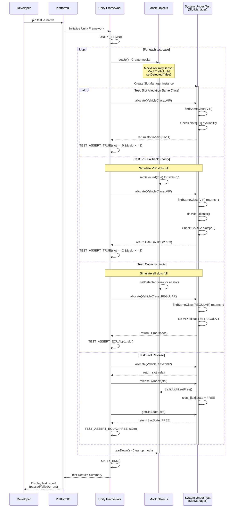

# Testing Environment - SEMAFARO

## Overview
Este documento detalla el funcionamiento del sistema de testing unitario implementado en el proyecto SEMAFARO, un sistema de control de estacionamiento basado en ESP32-S3.

## Configuración del Testing Environment

### PlatformIO Configuration
```ini
[env:native]
platform = native
test_framework = unity
build_flags =
  -DLOG_LEVEL=2
  -std=c++17
```

**Características principales:**
- **Platform**: `native` - Ejecuta en PC local, no requiere hardware ESP32-S3
- **Framework**: Unity Testing Framework - Estándar para embedded systems
- **C++ Standard**: C++17 para features modernas
- **Log Level**: 2 (WARNING level) para debugging durante tests

## Arquitectura de Testing

### Diagrama Secuencial UML - Flujo de Testing



### 1. Sistema de Mocks

#### Mock Pattern Implementation
```cpp
class MockProximitySensor {
public:
  void begin(uint8_t pin, bool pullup = true, bool normallyHigh = true) {}
  bool isDetected(uint32_t nowMs) { return detected_; }
  bool wasActivated() { return false; }
  bool wasDeactivated() { return false; }
  
  void setDetected(bool state) { detected_ = state; }  // Control manual
private:
  bool detected_ = false;
};

class MockTrafficLight {
public:
  void begin(uint8_t pinRed, uint8_t pinGreen) {}
  void setOccupied() { state_ = SlotState::OCCUPIED; }
  void setFree() { state_ = SlotState::FREE; }
  void setOff() {}
  SlotState getState() const { return state_; }
private:
  SlotState state_ = SlotState::FREE;
};
```

**Propósito de los Mocks:**
- Simular comportamiento de hardware sin dependencias físicas
- Control determinístico del estado de sensores y actuadores
- Ejecución rápida de tests sin delays de hardware

### 2. System Under Test (SUT)

#### SlotManager - Core Business Logic
El `SlotManager` es el componente principal bajo prueba, responsable de:

- **Asignación de slots** según tipo de vehículo (VIP, CARGA, REGULAR)
- **Políticas de prioridad** VIP con fallback a otros tipos
- **Gestión de capacidad** y validación de límites
- **Control de semáforos** por slot

```cpp
// Estructura de datos principal
struct Slot {
  SlotType type;           // VIP, CARGA, REGULAR
  SlotState state;         // FREE, OCCUPIED
  ProximitySensor sensor;  // Sensor inductivo
  TrafficLight trafficLight; // LED rojo/verde
  uint8_t id;
  const char* name;
};
```

### 3. Test Cases Implementados

#### Test Suite: test_slot_manager.cpp

**1. test_slot_allocation_same_class**
```cpp
void test_slot_allocation_same_class() {
  SlotManager manager;
  
  // Test VIP allocation (slots 0,1)
  int slot = manager.allocate(VehicleClass::VIP);
  TEST_ASSERT_TRUE(slot >= 0 && slot <= 1);
  
  // Test CARGA allocation (slots 2,3)
  slot = manager.allocate(VehicleClass::CARGA);
  TEST_ASSERT_TRUE(slot >= 2 && slot <= 3);
  
  // Test REGULAR allocation (slots 4,5)
  slot = manager.allocate(VehicleClass::REGULAR);
  TEST_ASSERT_TRUE(slot >= 4 && slot <= 5);
}
```

**2. test_vip_fallback_priority**
- Valida que vehículos VIP pueden usar slots CARGA o REGULAR cuando VIP está lleno
- Implementa la lógica de prioridad FASE 2 del sistema

**3. test_capacity_limits**
- Verifica rechazo de asignación cuando todos los slots están ocupados
- Retorna -1 cuando no hay capacidad disponible

**4. test_slot_release**
- Confirma liberación manual de slots
- Actualiza estado del semáforo correspondiente

## Problemas Identificados en la Implementación Actual

### 1. **Mocks Incompletos**
```cpp
// PROBLEMA: Los tests están comentados debido a dependencias no resueltas
// int slot1 = manager.allocate(VehicleClass::VIP);  // COMENTADO
// int slot2 = manager.allocate(VehicleClass::VIP);  // COMENTADO
```

**Causa raíz**: `SlotManager::begin()` requiere hardware real (pins, sensores)

### 2. **Dependencias de Hardware en Constructor**
```cpp
void SlotManager::begin() {
  // Configurar sensores y semáforos - REQUIERE HARDWARE
  slots_[0].sensor.begin(Pins::S_VIP1, true, true);
  slots_[0].trafficLight.begin(Pins::TL_VIP1.RED, Pins::TL_VIP1.GREEN);
  // ...
}
```

**Problema**: No se puede instanciar `SlotManager` sin hardware real

### 3. **Acoplamiento Fuerte**
- `SlotManager` directamente acoplado a clases de hardware
- No hay interfaz abstracta para dependency injection
- Tests no pueden sustituir hardware por mocks

## Estrategia de Solución

### 1. **Dependency Injection Pattern**
```cpp
// Propuesta: Interface abstracta
class ISensor {
public:
  virtual void begin(uint8_t pin, bool pullup, bool normallyHigh) = 0;
  virtual bool isDetected(uint32_t nowMs) = 0;
  virtual ~ISensor() = default;
};

class ITrafficLight {
public:
  virtual void begin(uint8_t pinRed, uint8_t pinGreen) = 0;
  virtual void setOccupied() = 0;
  virtual void setFree() = 0;
  virtual ~ITrafficLight() = default;
};
```

### 2. **Constructor Injection**
```cpp
class SlotManager {
public:
  SlotManager(std::array<ISensor*, 6> sensors, 
              std::array<ITrafficLight*, 6> lights);
  // ...
};
```

### 3. **Test Factory Pattern**
```cpp
// Para tests
SlotManager createTestManager() {
  std::array<ISensor*, 6> mockSensors = {/* mocks */};
  std::array<ITrafficLight*, 6> mockLights = {/* mocks */};
  return SlotManager(mockSensors, mockLights);
}

// Para producción
SlotManager createProductionManager() {
  std::array<ISensor*, 6> realSensors = {/* hardware */};
  std::array<ITrafficLight*, 6> realLights = {/* hardware */};
  return SlotManager(realSensors, realLights);
}
```

## Comandos de Testing

### Ejecución Local
```bash
# Ejecutar todos los tests
pio test -e native

# Ejecutar test específico
pio test -e native --filter "test_slot_allocation_same_class"

# Verbose output para debugging
pio test -e native -v
```

### Output Esperado
```
Testing...
test/test_slot_manager.cpp:XX:test_slot_allocation_same_class  [PASSED]
test/test_slot_manager.cpp:XX:test_vip_fallback_priority      [PASSED]
test/test_slot_manager.cpp:XX:test_capacity_limits            [PASSED]
test/test_slot_manager.cpp:XX:test_slot_release               [PASSED]

===== [SUMMARY] =====
4 passed, 0 failed, 0 skipped
```

## Métricas de Testing

### Coverage Goals
- **Unit Tests**: 90%+ coverage de lógica de negocio
- **Integration Tests**: Validación de FSM AccessController
- **Mock Coverage**: 100% substitución de hardware dependencies

### Performance Benchmarks
- **Test Execution**: < 5 segundos total
- **Memory Usage**: < 100MB durante test execution
- **CI/CD Integration**: Tests ejecutados en cada commit

## Roadmap de Mejoras

### Fase 1: Fixing Current Issues
1. Implementar dependency injection en SlotManager
2. Completar mock implementations
3. Habilitar todos los test cases comentados

### Fase 2: Extended Testing
1. Tests para AccessController FSM
2. Integration tests con múltiples componentes
3. Performance tests para timing crítico

### Fase 3: CI/CD Integration
1. GitHub Actions para automated testing
2. Test coverage reporting
3. Regression testing en pull requests

## Conclusión

El testing environment actual proporciona una base sólida para validación de lógica de negocio sin dependencias de hardware. Sin embargo, requiere refactoring para resolver el acoplamiento fuerte entre componentes de negocio y hardware. La implementación de dependency injection y mocks completos permitirá tests unitarios robustos y desarrollo más ágil.