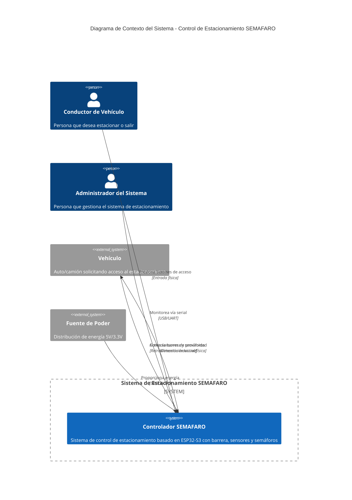
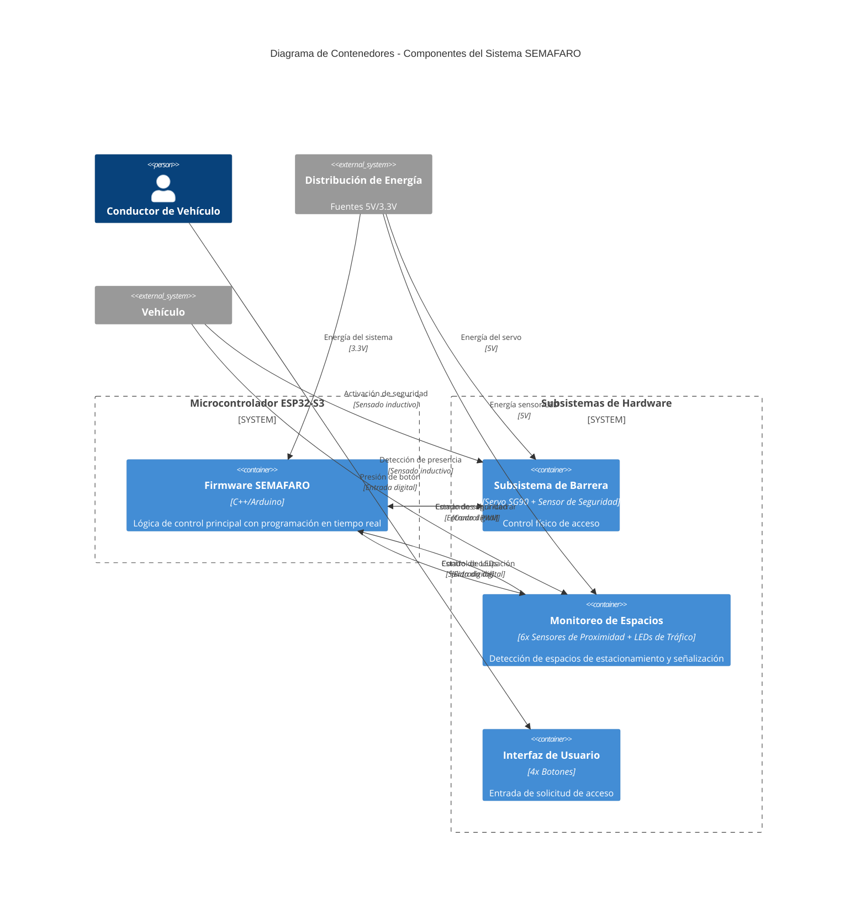
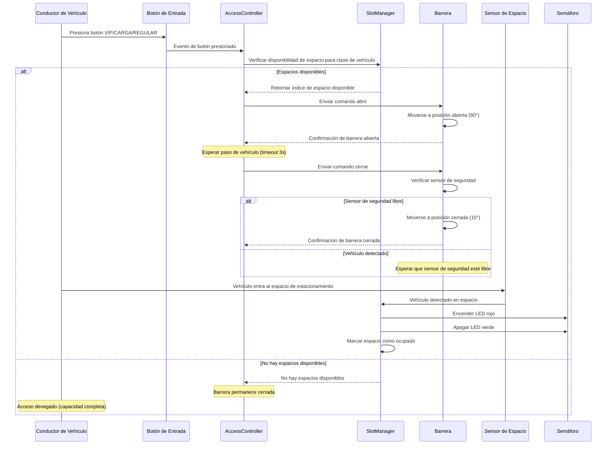
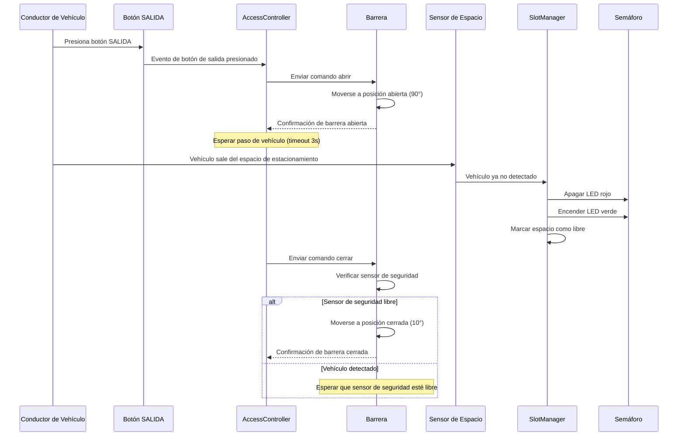
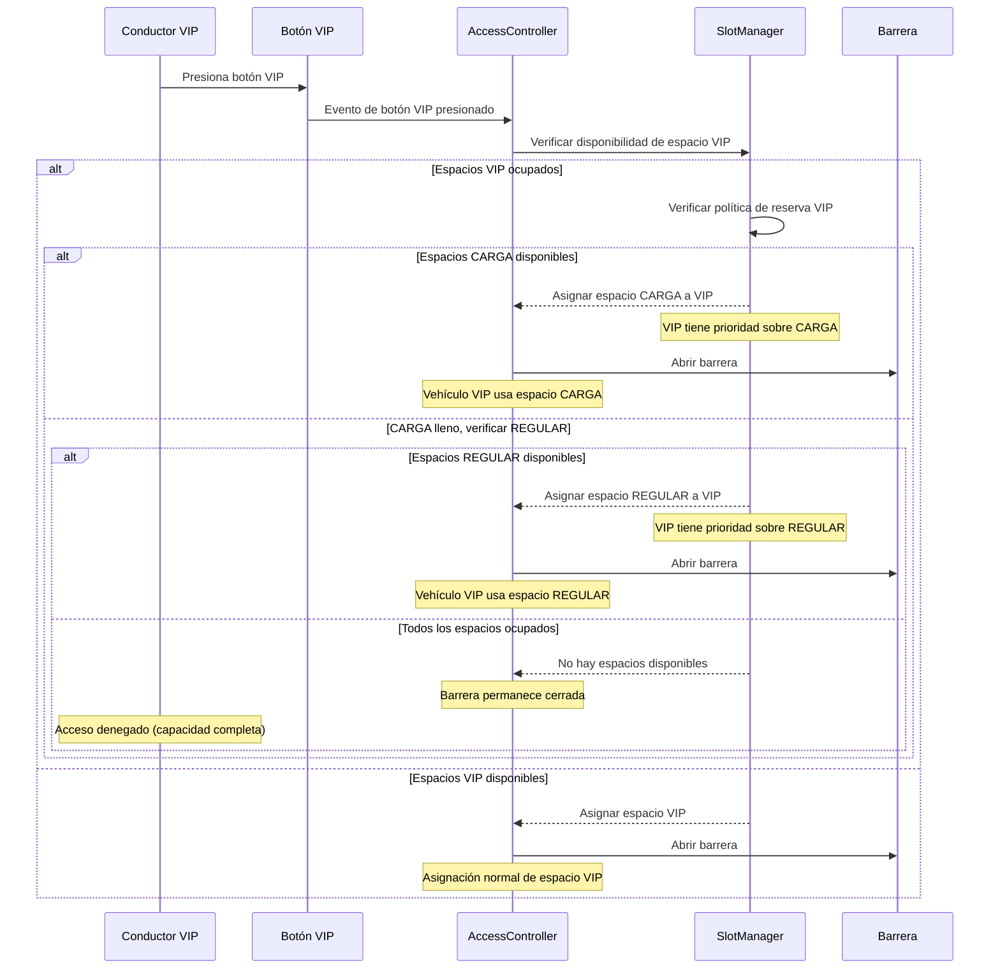
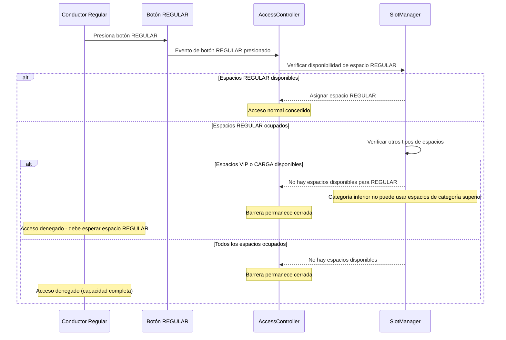

# SEMAFARO - Sistema de Control de Estacionamiento ESP32-S3

## 📋 Descripción del Proyecto

SEMAFARO es un sistema avanzado de control automático de estacionamiento basado en ESP32-S3 que gestiona una instalación de parqueo de 6 espacios con control inteligente de acceso, automatización de barrera, sensores de proximidad y señalización con semáforos. El sistema cuenta con gestión de prioridad VIP y monitoreo de espacios en tiempo real.

### Características
- **Control Automático de Barrera**: Barrera accionada por servo con protección de sensor de seguridad
- **Gestión de 6 Espacios**: 2 VIP, 2 CARGA, 2 REGULAR espacios de estacionamiento
- **Sistema de Semáforos**: Indicadores LED rojo/verde para cada espacio de parqueo
- **Acceso Prioritario**: Vehículos VIP pueden usar espacios de menor categoría cuando VIP está lleno
- **Protección de Seguridad**: Sensor inductivo de seguridad previene el cierre de barrera sobre vehículos
- **Arquitectura No Bloqueante**: Multitarea cooperativa en tiempo real con Scheduler

### Componentes de Hardware
- **MCU**: ESP32-S3 (4d_systems_esp32s3_gen4_r8n16)
- **Servo**: SG90 180° (control de barrera)
- **Sensores**: 7x sensores de proximidad inductivos (LJ12A3-4-Z/BY PNP NO)
- **Semáforos**: 6x módulos LED duales (rojo/verde por espacio)
- **Botones**: 4x botones de entrada (VIP, CARGA, REGULAR, SALIDA)
- **Módulo Relé**: 8 canales 5V para control de semáforos

## 🔌 Configuración de Pines del Hardware

### Asignación de Pines ESP32-S3

| Componente | Pin | Descripción |
|-----------|-----|-------------|
| **PWM Servo** | 5 | Control de servo de barrera (PWM LEDC) |
| **Botón Entrada VIP** | 6 | Solicitud de acceso VIP |
| **Botón Entrada CARGA** | 7 | Solicitud de acceso vehículo de carga |
| **Botón Entrada REGULAR** | 8 | Solicitud de acceso vehículo regular |
| **Botón SALIDA** | 9 | Solicitud de salida |
| **Sensor Seguridad** | 10 | Sensor de seguridad de barrera (inductivo) |

### Sensores de Espacios de Estacionamiento

| Espacio | Pin Sensor | Descripción |
|---------|------------|-------------|
| **Espacio VIP 1** | 11 | Espacio de estacionamiento VIP 1 |
| **Espacio VIP 2** | 12 | Espacio de estacionamiento VIP 2 |
| **Espacio CARGA 1** | 13 | Espacio de estacionamiento CARGA 1 |
| **Espacio CARGA 2** | 14 | Espacio de estacionamiento CARGA 2 |
| **Espacio REGULAR 1** | 15 | Espacio de estacionamiento REGULAR 1 |
| **Espacio REGULAR 2** | 16 | Espacio de estacionamiento REGULAR 2 |

### LEDs de Semáforos

| Espacio | LED Rojo | LED Verde | Descripción |
|---------|----------|-----------|-------------|
| **Espacio VIP 1** | 17 | 18 | Indicadores espacio VIP 1 |
| **Espacio VIP 2** | 19 | 20 | Indicadores espacio VIP 2 |
| **Espacio CARGA 1** | 21 | 35 | Indicadores espacio CARGA 1 |
| **Espacio CARGA 2** | 36 | 37 | Indicadores espacio CARGA 2 |
| **Espacio REGULAR 1** | 38 | 39 | Indicadores espacio REGULAR 1 |
| **Espacio REGULAR 2** | 40 | 41 | Indicadores espacio REGULAR 2 |

### Requerimientos de Energía
- **ESP32-S3**: 3.3V vía USB o fuente externa
- **Servo SG90**: 5V fuente externa (pico de 1000mA)
- **Sensores Inductivos**: 10-30V (PNP con conversión de nivel a 3.3V)
- **LEDs**: 5V a través de módulo de relé con resistencias limitadoras de 220Ω

## 🛠️ Configuración de Desarrollo

### Prerequisitos
1. **Visual Studio Code** (versión más reciente)
2. **Extensión PlatformIO IDE** para VS Code
3. **Git** para control de versiones
4. **Drivers ESP32-S3** (automático con PlatformIO)

### Configuración VS Code + PlatformIO

#### 1. Instalar Extensiones de VS Code
```bash
# Instalar extensión PlatformIO IDE
# Abrir VS Code -> Extensiones (Ctrl+Shift+X) -> Buscar "PlatformIO IDE" -> Instalar
```

#### 2. Clonar y Abrir Proyecto
```powershell
# Clonar el repositorio
git clone https://github.com/fr4nkastro/esp32-semafaro.git
cd esp32-semafaro

# Abrir en VS Code
code .
```

#### 3. Configuración PlatformIO
El proyecto está preconfigurado con `platformio.ini`:
```ini
[env:4d_systems_esp32s3_gen4_r8n16]
platform = espressif32
board = 4d_systems_esp32s3_gen4_r8n16
framework = arduino
monitor_speed = 115200
build_flags =
  -DCORE_DEBUG_LEVEL=3
  -DLOG_LEVEL=3
lib_deps = 
    madhephaestus/ESP32Servo@^0.13.0
```

### 🚀 Compilación y Despliegue

#### Compilar Proyecto
```powershell
# Usando CLI de PlatformIO
pio run -e 4d_systems_esp32s3_gen4_r8n16

# O usar paleta de comandos de VS Code (Ctrl+Shift+P)
# Escribir: "PlatformIO: Build"
```

#### Cargar al ESP32-S3
```powershell
# Cargar firmware
pio run -e 4d_systems_esp32s3_gen4_r8n16 -t upload

# O usar VS Code
# Hacer clic en el botón de carga de PlatformIO en la barra de estado
```

#### Monitorear Salida Serial
```powershell
# Monitorear serial a 115200 baudios
pio device monitor -e 4d_systems_esp32s3_gen4_r8n16

# O usar VS Code
# Hacer clic en el botón de monitor serial de PlatformIO
```

#### Limpiar Compilación (si es necesario)
```powershell
# Limpiar artefactos de compilación
pio run -e 4d_systems_esp32s3_gen4_r8n16 -t clean
```

### 🧪 Pruebas y Validación

#### Pruebas Unitarias
```powershell
# Ejecutar pruebas unitarias (cuando estén disponibles)
pio test -e 4d_systems_esp32s3_gen4_r8n16
```

#### Validación de Hardware
1. **Prueba de Servo**: Verificar movimiento de barrera (10° cerrado, 90° abierto)
2. **Prueba de Sensores**: Verificar los 7 sensores inductivos con objetos metálicos
3. **Prueba de Botones**: Verificar las 4 entradas de botón con anti-rebote
4. **Prueba de LEDs**: Confirmar funcionalidad de los 12 LEDs (6 rojos + 6 verdes)

## 🏗️ Arquitectura del Sistema - Modelo C4

### Contexto del Sistema (Nivel 1)


### Diagrama de Contenedores (Nivel 2)


### Diagrama de Componentes (Nivel 3)
```mermaid
C4Component
    title Diagrama de Componentes - Arquitectura del Firmware SEMAFARO

    System_Boundary(app, "Capa de Aplicación") {
        Component(access, "AccessController", "Clase C++", "FSM para control de barrera y lógica de entrada/salida")
        Component(slot_mgr, "SlotManager", "Clase C++", "Asignación de 6 espacios con reglas de prioridad VIP")
    }
    
    System_Boundary(devices, "Capa de Dispositivos") {
        Component(barrier_dev, "Barrier", "Clase C++", "Control de servo con integración de seguridad")
        Component(sensor_dev, "ProximitySensor", "Clase C++", "Lectura de sensor inductivo con anti-rebote")
        Component(button_dev, "Button", "Clase C++", "Manejo de entrada de botón con anti-rebote")
        Component(light_dev, "TrafficLight", "Clase C++", "Control de LED dual (rojo/verde)")
    }
    
    System_Boundary(core, "Infraestructura Central") {
        Component(scheduler, "Scheduler", "Clase C++", "Multitarea cooperativa no bloqueante")
        Component(logger, "Logger", "Macros", "Registro de depuración con niveles")
        Component(config, "Config", "Constantes", "Parámetros del sistema y temporización")
        Component(pins, "Pins", "Constantes", "Mapeo de pines de hardware")
    }
    
    Rel(access, slot_mgr, "Verificar disponibilidad", "Llamadas de función")
    Rel(access, barrier_dev, "Controlar barrera", "Comandos")
    Rel(slot_mgr, sensor_dev, "Leer ocupación", "Consultas de estado")
    Rel(slot_mgr, light_dev, "Actualizar indicadores", "Comandos")
    Rel(access, button_dev, "Leer entradas", "Consultas de estado")
    Rel(scheduler, access, "Ciclo de actualización", "Tick 20Hz")
    Rel(scheduler, slot_mgr, "Ciclo de actualización", "Tick 20Hz")
    Rel_Back(barrier_dev, sensor_dev, "Verificación de seguridad", "Consulta de estado")
    Rel_Down(devices, core, "Usa", "Infraestructura")
    Rel_Down(app, devices, "Controla", "APIs de dispositivos")
```

## 📊 Comportamiento del Sistema - Diagramas de Secuencia UML

### Fase 1: Proceso Básico de Entrada


### Fase 1: Proceso de Salida


### Fase 2: Reserva de Prioridad VIP


### Fase 2: Restricción de Vehículo de Categoría Inferior


## 🔧 Parámetros de Configuración

### Configuración de Temporización (`src/core/Config.hpp`)
- **Tiempo de Paso**: 3000ms (tiempo permitido para paso de vehículo)
- **Timeout de Apertura**: 5000ms (timeout de apertura de barrera)
- **Timeout de Cierre**: 3000ms (timeout de cierre de barrera)
- **Anti-rebote de Botón**: 30ms
- **Anti-rebote de Sensor**: 30ms
- **Frecuencia de Actualización Principal**: 20Hz (50ms)

### Configuración de Servo
- **Ángulo Cerrado**: 10° (barrera abajo)
- **Ángulo Abierto**: 90° (barrera arriba)
- **Paso de Movimiento**: 2° por tick (movimiento suave)
- **Temporización de Paso**: 20ms entre pasos

### Política de Prioridad VIP
- **Reserva Primaria**: Espacios CARGA
- **Reserva Secundaria**: Espacios REGULAR
- **Restricción**: Vehículos de categoría inferior no pueden usar espacios de categoría superior

## 📝 Estado del Sistema y Monitoreo

El sistema proporciona registro y monitoreo de estado comprensivo:

### Salida Serial (115200 baudios)
- **Estado del Sistema**: Impreso cada 30 segundos
- **Cambios de Estado**: Transiciones FSM del AccessController
- **Actualizaciones de Espacios**: Cambios de ocupación con marcas de tiempo
- **Registro de Errores**: Fallas de hardware y timeouts
- **Monitoreo de Heap**: Uso de memoria cada 5 segundos

### Niveles de Depuración
- **LOG_ERROR**: Errores críticos del sistema
- **LOG_WARN**: Condiciones de advertencia
- **LOG_INFO**: Información general (por defecto)
- **LOG_DEBUG**: Depuración detallada (verboso)

## 🚀 Estado del Proyecto
- **Versión Actual**: 1.0.0 MVP
- **Fase 1**: ✅ Control básico de entrada/salida con gestión de 6 espacios
- **Fase 2**: ✅ Prioridad VIP con políticas de reserva
- **Pruebas**: ⚠️ Validación de hardware en progreso
- **Documentación**: ✅ Guías completas de arquitectura y configuración

## 📚 Recursos Adicionales
- **Arquitectura Detallada**: `docs/PRD-MVP.md`
- **Lineamientos de Codificación**: `docs/lineamientos.md`
- **Ejemplos de Hardware**: `docs/ejemplo-servo.md`
- **Guía de Compilación**: `docs/BUILD-GUIDE.md`

## 🤝 Contribuciones
1. Hacer fork del repositorio
2. Crear una rama de característica (`git checkout -b feature/caracteristica-increible`)
3. Hacer commit de los cambios (`git commit -m 'Agregar característica increíble'`)
4. Push a la rama (`git push origin feature/caracteristica-increible`)
5. Abrir un Pull Request

## 📄 Licencia
Este proyecto está licenciado bajo la Licencia MIT - ver el archivo LICENSE para detalles.

---
*SEMAFARO - Sistema Inteligente de Control de Estacionamiento*
*ESP32-S3 | Tiempo Real | Arquitectura No Bloqueante*