# SEMAFARO - ESP32-S3 Parking Control System

## 📋 Project Overview

SEMAFARO is an advanced ESP32-S3 based automated parking control system that manages a 6-slot parking facility with intelligent access control, barrier automation, proximity sensors, and traffic light signaling. The system features VIP priority management and real-time slot monitoring.

### Features
- **Automated Barrier Control**: Servo-driven barrier with safety sensor protection
- **6-Slot Management**: 2 VIP, 2 CARGA, 2 REGULAR parking spaces
- **Traffic Light System**: Red/Green LED indicators for each parking slot
- **Priority Access**: VIP vehicles can use lower-tier slots when VIP is full
- **Safety Protection**: Inductive safety sensor prevents barrier closure on vehicles
- **Non-blocking Architecture**: Real-time cooperative multitasking with Scheduler

### Hardware Components
- **MCU**: ESP32-S3 (4d_systems_esp32s3_gen4_r8n16)
- **Servo**: SG90 180° (barrier control)
- **Sensors**: 7x inductive proximity sensors (LJ12A3-4-Z/BY PNP NO)
- **Traffic Lights**: 6x dual LED modules (red/green per slot)
- **Buttons**: 4x entry buttons (VIP, CARGA, REGULAR, EXIT)
- **Relay Module**: 8-channel 5V relay for traffic light control

## 🔌 Hardware Pinout Configuration

### ESP32-S3 Pin Assignment

| Component | Pin | Description |
|-----------|-----|-------------|
| **Servo PWM** | 5 | Barrier servo control (LEDC PWM) |
| **VIP Entry Button** | 6 | VIP access request |
| **CARGA Entry Button** | 7 | Cargo vehicle access request |
| **REGULAR Entry Button** | 8 | Regular vehicle access request |
| **EXIT Button** | 9 | Exit request |
| **Safety Sensor** | 10 | Barrier safety sensor (inductive) |

### Parking Slot Sensors

| Slot | Sensor Pin | Description |
|------|------------|-------------|
| **VIP Slot 1** | 11 | VIP parking space 1 |
| **VIP Slot 2** | 12 | VIP parking space 2 |
| **CARGA Slot 1** | 13 | Cargo parking space 1 |
| **CARGA Slot 2** | 14 | Cargo parking space 2 |
| **REGULAR Slot 1** | 15 | Regular parking space 1 |
| **REGULAR Slot 2** | 16 | Regular parking space 2 |

### Traffic Light LEDs

| Slot | Red LED | Green LED | Description |
|------|---------|-----------|-------------|
| **VIP Slot 1** | 17 | 18 | VIP space 1 indicators |
| **VIP Slot 2** | 19 | 20 | VIP space 2 indicators |
| **CARGA Slot 1** | 21 | 35 | Cargo space 1 indicators |
| **CARGA Slot 2** | 36 | 37 | Cargo space 2 indicators |
| **REGULAR Slot 1** | 38 | 39 | Regular space 1 indicators |
| **REGULAR Slot 2** | 40 | 41 | Regular space 2 indicators |

### Power Requirements
- **ESP32-S3**: 3.3V via USB or external power
- **Servo SG90**: 5V external supply (1000mA peak)
- **Inductive Sensors**: 10-30V (PNP with 3.3V level conversion)
- **LEDs**: 5V through relay module with 220Ω current limiting resistors

## 🛠️ Development Setup

### Prerequisites
1. **Visual Studio Code** (latest version)
2. **PlatformIO IDE Extension** for VS Code
3. **Git** for version control
4. **ESP32-S3 drivers** (automatic with PlatformIO)

### VS Code + PlatformIO Setup

#### 1. Install VS Code Extensions
```bash
# Install PlatformIO IDE extension
# Open VS Code -> Extensions (Ctrl+Shift+X) -> Search "PlatformIO IDE" -> Install
```

#### 2. Clone and Open Project
```powershell
# Clone the repository
git clone https://github.com/fr4nkastro/esp32-semafaro.git
cd esp32-semafaro

# Open in VS Code
code .
```

#### 3. PlatformIO Configuration
The project is pre-configured with `platformio.ini`:
```ini
[env:4d_systems_esp32s3_gen4_r8n16]
platform = espressif32
board = 4d_systems_esp32s3_gen4_r8n16
framework = arduino
monitor_speed = 115200
build_flags =
  -DCORE_DEBUG_LEVEL=3
  -DLOG_LEVEL=3
lib_deps = 
    madhephaestus/ESP32Servo@^0.13.0
```

### 🚀 Build and Deploy

#### Compile Project
```powershell
# Using PlatformIO CLI
pio run -e 4d_systems_esp32s3_gen4_r8n16

# Or use VS Code command palette (Ctrl+Shift+P)
# Type: "PlatformIO: Build"
```

#### Upload to ESP32-S3
```powershell
# Upload firmware
pio run -e 4d_systems_esp32s3_gen4_r8n16 -t upload

# Or use VS Code
# Click PlatformIO upload button in status bar
```

#### Monitor Serial Output
```powershell
# Monitor serial at 115200 baud
pio device monitor -e 4d_systems_esp32s3_gen4_r8n16

# Or use VS Code
# Click PlatformIO serial monitor button
```

#### Clean Build (if needed)
```powershell
# Clean build artifacts
pio run -e 4d_systems_esp32s3_gen4_r8n16 -t clean
```

### 🧪 Testing and Validation

#### Unit Tests
```powershell
# Run unit tests (when available)
pio test -e 4d_systems_esp32s3_gen4_r8n16
```

#### Hardware Validation
1. **Servo Test**: Verify barrier movement (10° closed, 90° open)
2. **Sensor Test**: Check all 7 inductive sensors with metal objects
3. **Button Test**: Verify all 4 button inputs with debouncing
4. **LED Test**: Confirm all 12 LEDs (6 red + 6 green) functionality

## 🏗️ System Architecture - C4 Model

### System Context (Level 1)


### Container Diagram (Level 2)


### Component Diagram (Level 3)
```mermaid
C4Component
    title Component Diagram - SEMAFARO Firmware Architecture

    System_Boundary(app, "Application Layer") {
        Component(access, "AccessController", "C++ Class", "FSM for barrier control and entry/exit logic")
        Component(slot_mgr, "SlotManager", "C++ Class", "6-slot allocation with VIP priority rules")
    }
    
    System_Boundary(devices, "Device Layer") {
        Component(barrier_dev, "Barrier", "C++ Class", "Servo control with safety integration")
        Component(sensor_dev, "ProximitySensor", "C++ Class", "Debounced inductive sensor reading")
        Component(button_dev, "Button", "C++ Class", "Debounced button input handling")
        Component(light_dev, "TrafficLight", "C++ Class", "Dual LED control (red/green)")
    }
    
    System_Boundary(core, "Core Infrastructure") {
        Component(scheduler, "Scheduler", "C++ Class", "Non-blocking cooperative multitasking")
        Component(logger, "Logger", "Macros", "Debug logging with levels")
        Component(config, "Config", "Constants", "System parameters and timing")
        Component(pins, "Pins", "Constants", "Hardware pin mapping")
    }
    
    Rel(access, slot_mgr, "Check availability", "Function calls")
    Rel(access, barrier_dev, "Control barrier", "Commands")
    Rel(slot_mgr, sensor_dev, "Read occupancy", "State queries")
    Rel(slot_mgr, light_dev, "Update indicators", "Commands")
    Rel(access, button_dev, "Read inputs", "State queries")
    Rel(scheduler, access, "Update cycle", "20Hz tick")
    Rel(scheduler, slot_mgr, "Update cycle", "20Hz tick")
    Rel_Back(barrier_dev, sensor_dev, "Safety check", "State query")
    Rel_Down(devices, core, "Uses", "Infrastructure")
    Rel_Down(app, devices, "Controls", "Device APIs")
```

## 📊 System Behavior - UML Sequence Diagrams

### Phase 1: Basic Entry Process


### Phase 1: Exit Process

```mermaid
sequenceDiagram
    participant Driver as Vehicle Driver
    participant ExitBtn as EXIT Button
    participant AC as AccessController
    participant Barrier as Barrier
    participant Sensor as Slot Sensor
    participant SM as SlotManager
    participant Light as Traffic Light

    Driver->>ExitBtn: Press EXIT button
    ExitBtn->>AC: Exit button pressed event
    AC->>Barrier: Send open command
    Barrier->>Barrier: Move to open position (90°)
    Barrier-->>AC: Barrier opened confirmation
    
    Note over AC: Wait for vehicle passage (3s timeout)
    
    Driver->>Sensor: Vehicle leaves parking slot
    Sensor->>SM: Vehicle no longer detected
    SM->>Light: Turn off red LED  
    SM->>Light: Turn on green LED
    SM->>SM: Mark slot as free
    
    AC->>Barrier: Send close command
    Barrier->>Barrier: Check safety sensor
    
    alt Safety sensor clear
        Barrier->>Barrier: Move to closed position (10°)
        Barrier-->>AC: Barrier closed confirmation
    else Vehicle detected
        Note over Barrier: Wait for safety sensor clear
    end
```


### Phase 2: VIP Priority Fallback


### Phase 2: Lower-Tier Vehicle Restriction


## 🔧 Configuration Parameters

### Timing Configuration (`src/core/Config.hpp`)
- **Pass Time**: 3000ms (time allowed for vehicle passage)
- **Open Timeout**: 5000ms (barrier opening timeout)
- **Close Timeout**: 3000ms (barrier closing timeout)
- **Button Debounce**: 30ms
- **Sensor Debounce**: 30ms
- **Main Update Frequency**: 20Hz (50ms)

### Servo Configuration
- **Closed Angle**: 10° (barrier down)
- **Open Angle**: 90° (barrier up)
- **Movement Step**: 2° per tick (smooth motion)
- **Step Timing**: 20ms between steps

### VIP Priority Policy
- **Primary Fallback**: CARGA slots
- **Secondary Fallback**: REGULAR slots
- **Restriction**: Lower-tier vehicles cannot use higher-tier slots

## 📝 System Status and Monitoring

The system provides comprehensive logging and status monitoring:

### Serial Output (115200 baud)
- **System Status**: Printed every 30 seconds
- **State Changes**: AccessController FSM transitions
- **Slot Updates**: Occupancy changes with timestamps
- **Error Logging**: Hardware faults and timeouts
- **Heap Monitoring**: Memory usage every 5 seconds

### Debug Levels
- **LOG_ERROR**: Critical system errors
- **LOG_WARN**: Warning conditions
- **LOG_INFO**: General information (default)
- **LOG_DEBUG**: Detailed debugging (verbose)

## 🚀 Project Status
- **Current Version**: 1.0.0 MVP
- **Phase 1**: ✅ Basic entry/exit control with 6-slot management
- **Phase 2**: ✅ VIP priority with fallback policies
- **Testing**: ⚠️ Hardware validation in progress
- **Documentation**: ✅ Complete architecture and setup guides

## 📚 Additional Resources
- **Detailed Architecture**: `docs/PRD-MVP.md`
- **Coding Guidelines**: `docs/lineamientos.md`
- **Hardware Examples**: `docs/ejemplo-servo.md`
- **Build Guide**: `docs/BUILD-GUIDE.md`

## 🤝 Contributing
1. Fork the repository
2. Create a feature branch (`git checkout -b feature/amazing-feature`)
3. Commit your changes (`git commit -m 'Add amazing feature'`)
4. Push to the branch (`git push origin feature/amazing-feature`)
5. Open a Pull Request

## 📄 License
This project is licensed under the MIT License - see the LICENSE file for details.

---
*SEMAFARO - Intelligent Parking Control System*
*ESP32-S3 | Real-time | Non-blocking Architecture*